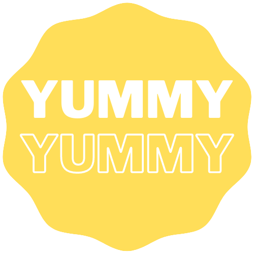

# YummyYummy Website

This a website made to help users decide in which restaurant to eat. We believe that YummyYummy will allow users to enjoy their meals as much as possible, and at the same time, reward the good restaurants with more clients.

This website will also support take-away orders. The users will be able to order from all the different kinds of restaurants, after creating an account. The restaurant owners will also have access to the orders made to their restaurant in their account.

We hope you like our website after it's done.

YummyYuummy will give you the most YummyYummy Food!!!

 

## UI Mock-up
---
### Logo
This is our YummyYummy Logo:

In the future, this logo will bring back memories of your best meals ever!

 

Now we have the first mock-ups of our website. Keep in mind that some design choices may change throughout the project development.

### Home Page

 

## UML
---

This is the UML of our database for the YummyYummy website.

### Developers

- João Alves
- José Araújo
- Eva Carvalho (design of images)

### Class 15
### Group 06