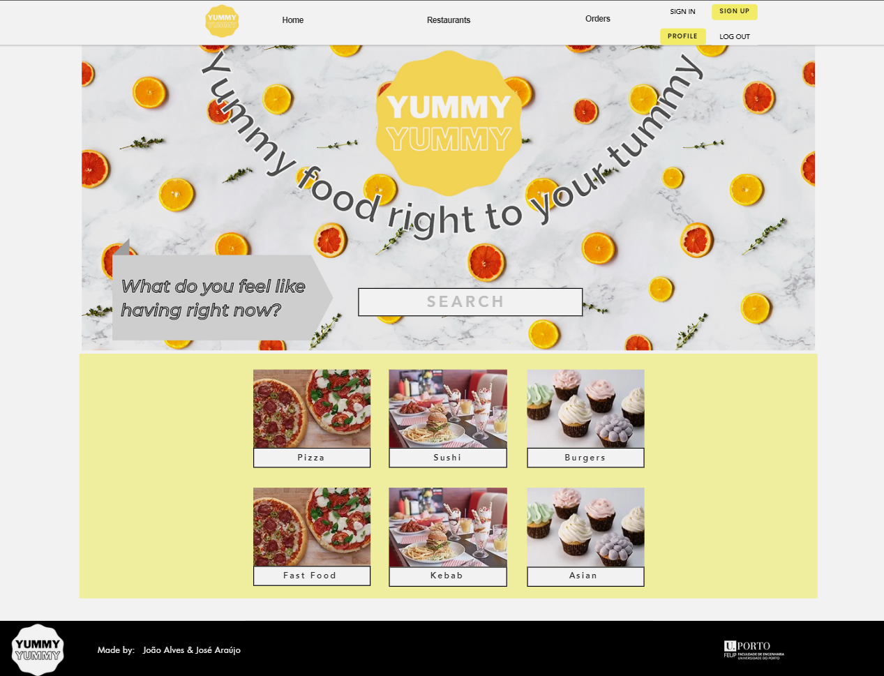

# YummyYummy Website

This a website made to help users decide in which restaurant to eat. We believe that YummyYummy will allow users to enjoy their meals as much as possible, and at the same time, reward the good restaurants with more clients.

This website will also support take-away orders. The users will be able to order from all the different kinds of restaurants, after creating an account. The restaurant owners will also have access to the orders made to their restaurant in their account.

We hope you like our website!

YummyYummy will give you the most YummyYummy Food!!!

 

---

## UI Mock-up

### Logo
This is our YummyYummy Logo:

In the future, this logo will bring back memories of your best meals ever!

 

Now we have the first mock-ups of our website. Keep in mind that some design choices may change throughout the project development.

### Home Page

 

### Restaurants Page

 

### Restaurant Page (Single)

 

### Orders Page

 

---

## UML

This is the UML of our database for the YummyYummy website.

Keep in mind that some extra changes might be made in order to add functionalities.

 

### Features

- [x] General 
    - [x] Make header
    - [x] Make footer
    - [x] Make header interactive - insert login and signup if not already signed in
    - [x] Make header interactive - add certain options of redirecting links to pages according to login type
    - [x] Add logo to header
    - [x] Add website author's name in footer
    - [x] Add website support team's contact number in footer
    - [x] Add website logo in footer
    - [x] Add FEUP logo in footer
    - [x] Adapt both footer and header to smaller sized screens
    - [x] Make dropdown button which shows links of header for smaller sized screens

- [x] Home Page
    - [x] Make search box in main page to look up some restaurants
    - [x] Add big custom banner
    - [x] Add food categories section
    - [x] Add links to food categories images

- [x] Login/Logout/Sign In/Sign Up
    - [x] Three different login types
    - [x] Signup with two different account types
    - [x] Add login verifications and throw message errors in case something unexpected happens

- [x] Restaurants Page
    - [x] Display all restaurants available in database 
    - [x] Display each restaurants name and picture
    - [x] If request to access Restaurants Page came from Home Page's categories section, display all restaurants included in that category and the respective category's image
    - [x] When you click on a restaurant's card, redirect to restaurant's page

- [x] Individual Restaurant Page
    - [x] Display restaurant's image
    - [x] Display restaurant's rating and price according to reviews
    - [x] Display if restaurant is opened or closed and according to that state text color is green or red
    - [x] Display restaurant's categories
    - [x] Display restaurant's phone numer and location
    - [x] Display restaurant's menu
    - [x] Add/delete items to menu 
    - [x] Add option to edit menu and add discounts to items if account type is restaurant owner and is registered as owner of that same restaurant
    - [x] Display original price before discount was applied
    - [x] Display restaurant reviews and replies
    - [x] Add option to reply to reviews if account type is restaurant owner and is registered as owner of that same restaurant
    - [x] Add option to write a review and rate price and restaurant if login type is client and hasn't wrote one yet
    - [x] Make review's rating color interactive depending on rating given by reviewer
    - [x] Add button to add to/remove from favourite restaurants list if user is a client
    - [x] If login type is client, show order tab
    - [x] If login type is client, be able to add menu items to order
    - [x] If login type is client, be able to make the order
    - [x] If login type is client, be able to remove items from order tab
    - [x] If login type is client, increase each product ordered quantity

- [x] Profile Page
    - [x] Display all information we have on user in database 
    - [x] Add option for user to edit all its information 
    - [x] Add user's favourite restaurants list if user is client
    - [x] Add restaurants owned by user if user is a restaurant owner
    - [x] Make each entry in both client and owner's Favourite Restaurants / Restaurants Owned have a link redirect user to restaurant 
    - [x] Add option to update profile picture

- [x] Orders Page
    - [x] Order color changing depending on Order Status 
    - [x] Add ability to restaurant owner and courier change order status
    - [x] Make client able to see order status
    - [x] Limit restaurant owner's ability to change order status to: RECEIVED, PREPARING and READY
    - [x] Limit courier's ability to change order status to: READY and DELIVERED
    - [x] Show to couriers all available orders that haven't been picked 
    - [x] Show couriers all orders that have been picked by them and make them able to change order status
    - [x] Show each order details (date and time the order has been made, order's price, each products quantity, show delivery address)
    - [x] Sort orders according to date
    - [ ] Display something when there are no orders placed
   

- [x] Security
    - [x] Hash passwords ("PASSWORD_DEFAULT", "cost => 12")
    - [x] Filter user entries
    - [x] Encode user entries
    - [x] Anti-SQL injection through "prepare" statements in database access

- Extra (not done): 
    - Make database "bigger" 

 

### Credentials (username/password): 
- Client account: andresantos / abba ; 
- Restaurant Owner account: anamarota / abba ; 
- Courier account: joaobezugo / abba ; 

### Developers

- João Alves
- José Araújo
- Eva Carvalho (design of images)

### Class 15
### Group 06
