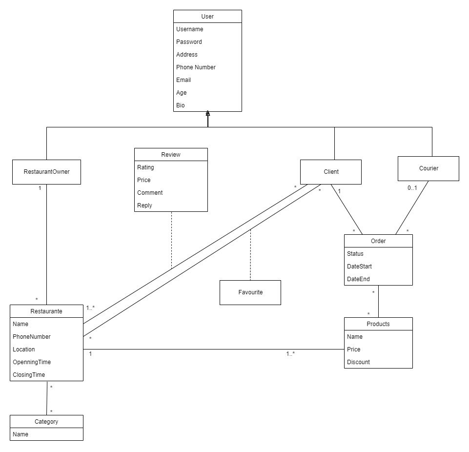

# YummyYummy Website

This a website made to help users decide in which restaurant to eat. We believe that YummyYummy will allow users to enjoy their meals as much as possible, and at the same time, reward the good restaurants with more clients.

This website will also support take-away orders. The users will be able to order from all the different kinds of restaurants, after creating an account. The restaurant owners will also have access to the orders made to their restaurant in their account.

We hope you like our website after it's done.

YummyYuummy will give you the most YummyYummy Food!!!

 

---

## UI Mock-up

### Logo
This is our YummyYummy Logo:

In the future, this logo will bring back memories of your best meals ever!

 

Now we have the first mock-ups of our website. Keep in mind that some design choices may change throughout the project development.

### Home Page

 

### Restaurants Page

 

### Restaurant Page (Single)

 

### Orders Page

 

---

## UML

This is the UML of our database for the YummyYummy website.

Keep in mind that some extra changes might be made in order to add functionalities.

### Developers

- João Alves
- José Araújo
- Eva Carvalho (design of images)

### Class 15
### Group 06

# Details we still need to do:

hash passwords
Profile of a user (css missing)
When making an order, make sure you only insert product of the same restaurant
Use javascript maybe to change the color of things in single restaurant page
List the menu of each restaurant in it's page and add a way to create a "basket" for an order 
(invetar um número de tele aleatório para colocar no footer e fingir como linha de suport técnico)
adicionar comentários/reviews
editar perfil
donos dos restaurantes, editar perfil dos restaurantes, adicionar/editar pratos, e etc
marcar restaurantes como favoritos (talvez se tenha de criar uma nova table na base de dados para isto)

